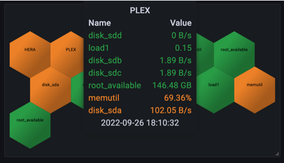

# Annotation queries2

Annotations let you overlay events from [Service Name] on any Grafana panel. Use them to correlate metrics with deployments, incidents, or other events.



## Adding an annotation query

1. Open your dashboard and click **Dashboard settings** (gear icon).
1. Select **Annotations** from the sidebar.
1. Click **Add annotation query**.
1. Select **DocsTest** as the data source.
1. Configure the query fields below.

## Configuration

| Field           | Description                                                           |
| --------------- | --------------------------------------------------------------------- |
| **Query**       | The query to fetch events. Must return at least a timestamp field.    |
| **Title field** | The field to use as the annotation title.                             |
| **Text field**  | The field to use as the annotation body text.                         |
| **Tags field**  | Optional. The field to use for annotation tags, useful for filtering. |

## Example

Query events from an `events` table and display them as annotations:

**Query:**

```
SELECT timestamp, title, description, tags
FROM events
WHERE severity IN ('critical', 'warning')
```

**Field mapping:**
| Setting | Value |
|---------|-------|
| Title field | `title` |
| Text field | `description` |
| Tags field | `tags` |

This displays critical and warning events as annotations on your panels, allowing you to correlate metric changes with events in [Service Name].
