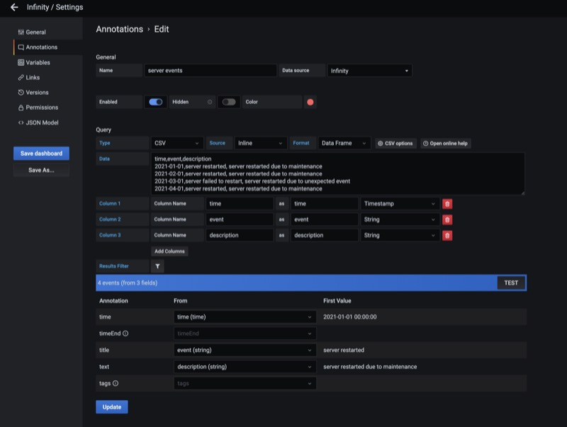
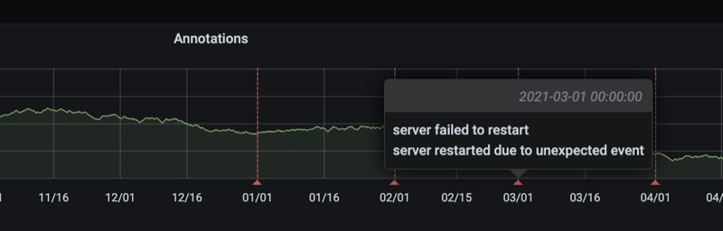

## Annotations

You can annotate data from an API using Grafana's annotations feature. To add annotations, select the Infinity data source as your annotation source. You can create annotation from JSON, CSV, XML, or GraphQL endpoints. The source of annotation can be inline or a remote URL as well.

> Make sure to select "Data Frame" as format.

To create annotations, you need to specify a time field and a string field. Make sure your query returns at least these two fields:

> Annotations are supported from plugin version 0.7.4.
