## Overview

Looking for a quick start example? Please check [How to Visualize CSV Data with Grafana](https://grafana.com/blog/2025/02/05/how-to-visualize-csv-data-with-grafana/). This page covers details the various powerful configuration options for dealing with CSV data in Infinity.

Alternatively, for a more concise learning journey, check out our Grafana Infinity data source learning journey:

[Learning journey: Visualize CSV data using the Infinity data source](https://grafana.com/docs/learning-journeys/infinity-csv/)

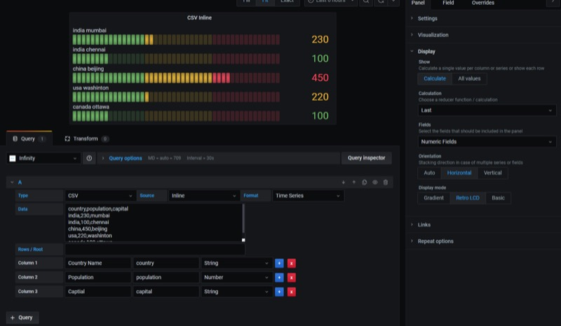

[Try it live: Infinity plugin CSV demo](https://play.grafana.org/d/infinity-csv)

Select **Type** of the query to `CSV`. You can either specify the URL of the CSV file or can provide inline CSV.

> CSV data should have columns as its first line and be comma delimited. If not, specify them in the CSV options. By default, all the columns will be parsed and returned as strings. You need to specify the column names and their types, in case you need to parse them in correct format.

If your CSV doesn't have headers, you can specify them in the **CSV options** headers. Read more about the advance CSV settings like custom delimiters at below in CSV options section.

## CSV URL example

CSV URL : `https://thingspeak.com/channels/38629/feed.csv`

The following example uses a CSV file from ThingSpeak traffic analysis. In the following screenshot, visualizes the CSV as a table using just the URL.

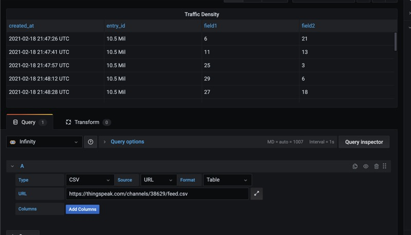

Sample data from the aforementioned CSV data.

```bash
created_at,entry_id,field1,field2
2021-02-18 21:46:23 UTC,10458189,6.000000,12.000000
2021-02-18 21:46:39 UTC,10458190,0.000000,36.000000
2021-02-18 21:46:55 UTC,10458191,0.000000,49.000000
2021-02-18 21:47:10 UTC,10458192,2.000000,34.000000
2021-02-18 21:47:26 UTC,10458193,6.000000,21.000000
2021-02-18 21:47:41 UTC,10458194,11.000000,13.000000
2021-02-18 21:47:57 UTC,10458195,25.000000,3.000000
2021-02-18 21:48:12 UTC,10458196,29.000000,6.000000

```

## CSV With fields specification

From the same data above, by adding columns and their types, we can convert the CSV table into a graph. For a graph or any time series visualization, you need a time column and one or more numeric columns.

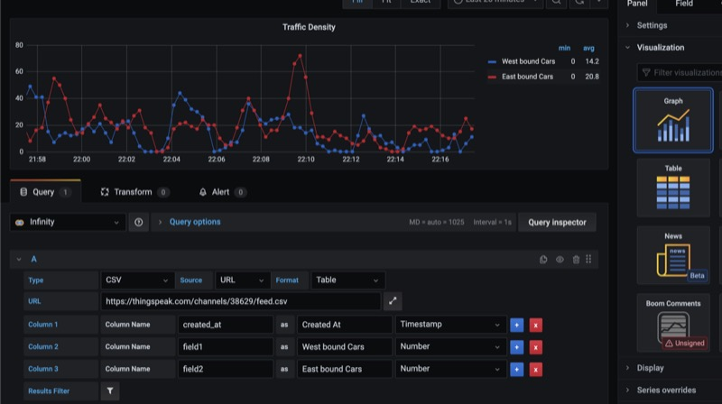

## CSV without time fields

URL : `https://gist.githubusercontent.com/yesoreyeram/64a46b02f0bf87cb527d6270dd84ea47/raw/51f2a5e4fe7c3d010a3fe4ae4b6d07961b2ab047/population.csv`

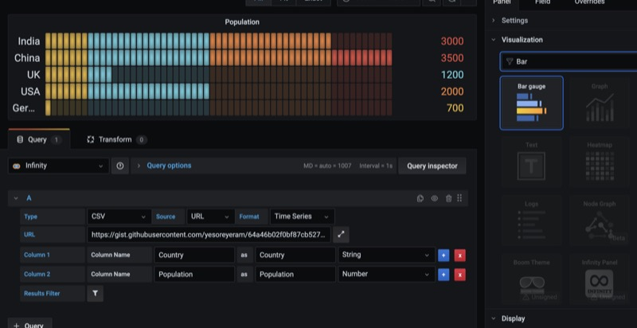

In the above example, we don't have any time field. We have a string field and a number field. In this case, by choosing format as timeseries we are simulating the point-in-time as timeseries data. With this option, you can use csv into visualizations like Bar Gauge, Stats Panel, Gauge panel etc.

Sample Data

```bash
Country,Population
India,3000
China,3500
UK,1200
USA,2000
Germany,700
```

## Columns

Even if your CSV file has columns, you should specify them manually, and only those fields will be considered for display. The columns will appear in the order you specify. Each column will have the following properties:

| Column   | Description                                      |
| -------- | ------------------------------------------------ |
| Title    | Title of the column when using the table format. |
| Selector | Column name in CSV file. Case sensitive.         |
| Format   | Format of the column.                            |

If you don't specify any columns, then the Infinity plugin will try to auto generate the columns and all the fields will be returned as string. This automatically generates columns feature only works with table format.

## CSV URL

In the following example, we are going to convert the CSV URL `https://gist.githubusercontent.com/yesoreyeram/64a46b02f0bf87cb527d6270dd84ea47/raw/32ae9b1a4a0183dceb3596226b818c8f428193af/sample-with-quotes.csv` into a Grafana data source.

CSV data should have columns as its first line and be comma delimited. You also need to specify the column names manually for display purposes.

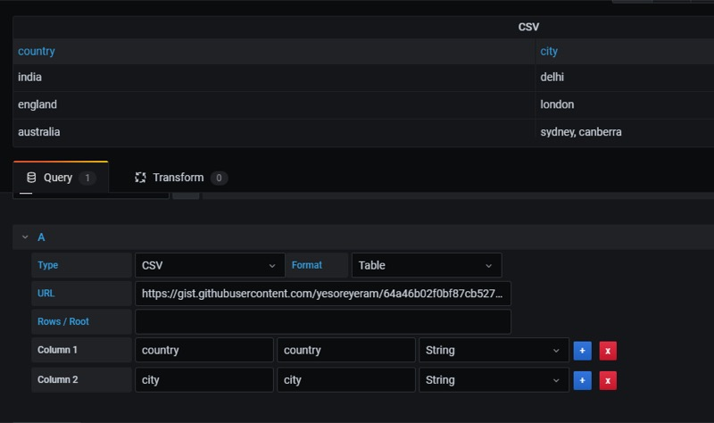

You can ignore the root/rows as each line of CSV will be your rows.

## CSV Inline

Instead of specifying the URL, you can also use hardcoded CSV values. For example, you can specify the CSV in the following format:

```bash
country,population,capital
india,200,mumbai
india,100,chennai
china,500,beijing
usa,200,washington
canada,100,ottawa
```

The following screenshot shows the example of CSV inline data source:


## CSV Options

| Option                | Description                                                                                                                                                                                          |
| --------------------- | ---------------------------------------------------------------------------------------------------------------------------------------------------------------------------------------------------- |
| Delimiter             | If your CSV file have any other delimiter than comma, then specify here. For tab delimited files, specify `\t` as delimiter.                                                                         |
| Headers               | If CSV file doesn't have headers, specify here as comma separated values here.                                                                                                                       |
| Skip empty lines      | Check this if you want to skip the empty lines.                                                                                                                                                      |
| Skip lines with error | Check this if you want to skip the lines with error.                                                                                                                                                 |
| Relax column count    | Check this if you want to relax the column count check.                                                                                                                                              |
| Comment               | If your CSV lines have comments, enter the comments delimiter. Treat all the characters after this one as a comment. Example: setting `#` will treat everything in each line after `#` as a comment. |

> All these CSV options are available from version 0.7.

## CSV without headers

If your CSV doesn't have headers, specify them in the **CSV Options** Headers option. You have list the headers in comma separated strings. Leave blank if your CSV have headers.

## Custom delimiters / TSV file

You can use custom delimiter for your CSV file. You can set them in the **CSV options** delimiter section. Specify `\t` for TSV files.

For TSV files, you can choose TSV as query type. This works in the same way as specified above.

## CSV to time series

### One time field and one metric field

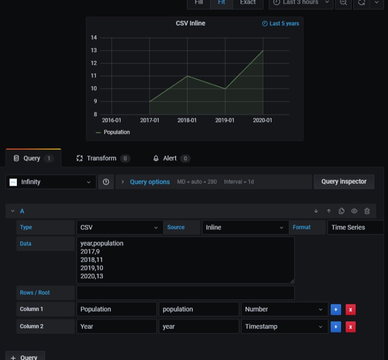

### One time field, one string field and one metric field

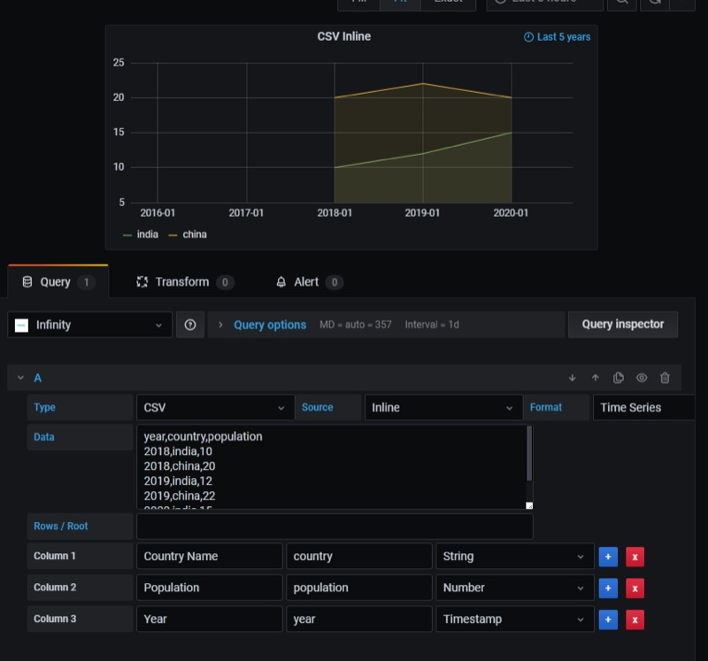

### One time field, one string field and multiple metric fields

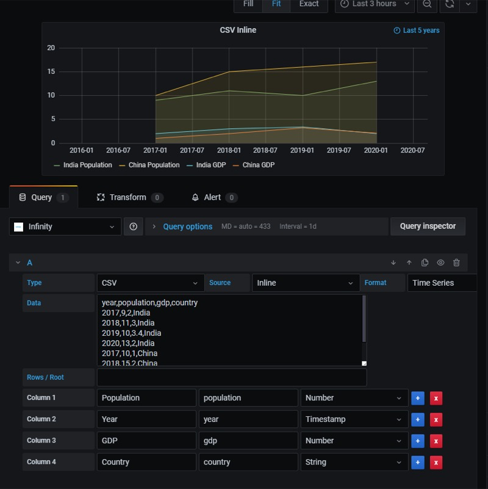

### One time field and multiple metric fields

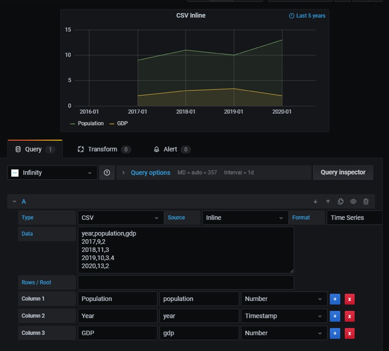

### One string field and one number field

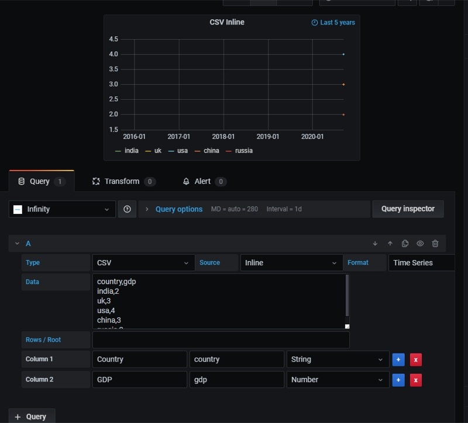

### One time field, multiple string and number fields

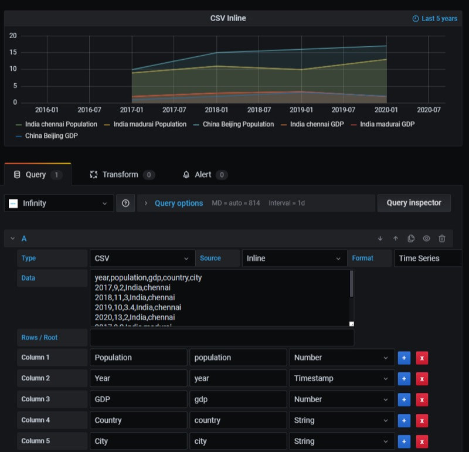

### All Number fields (Timestamp, UserId and Metric)

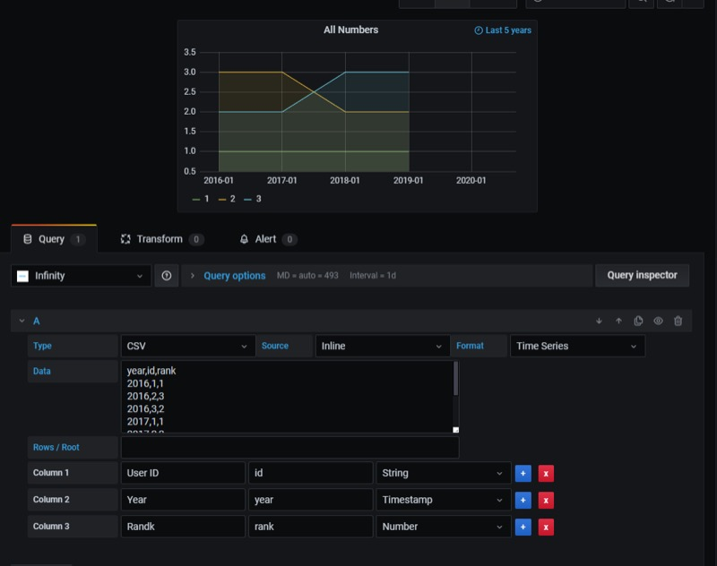

## Looking for more CSV options?

If you are looking for more CSV options like group by, order by, field manipulation etc, then use [UQL query](./query/uql.md). Following is the simple UQL command to parse:

```sql
parse-csv
| order by "field" asc
```

Infinity strongly suggests to use **UQL** instead **CSV** type. Give it a try and let us know the feedback.
