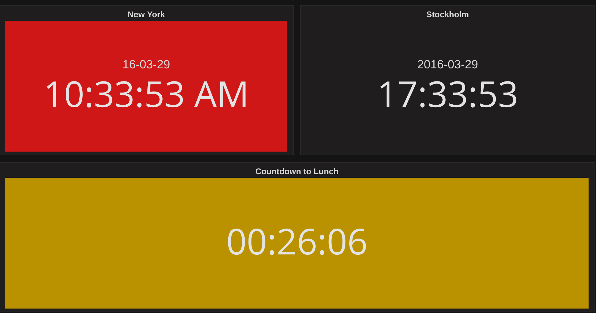

The examples below use the `panels[]` entry shape from a dashboard's `dashboard.json`. Trim `gridPos` and `id` to fit your own dashboard.



## Basic example

The smallest useful Clock panel shows the current time with no datasource at all:

```json
{
  "type": "grafana-clock-panel",
  "title": "Time in local timezone",
  "options": {
    "mode": "time",
    "refresh": "sec",
    "clockType": "24 hour",
    "timezone": "",
    "bgColor": "",
    "fontMono": false,
    "timeSettings": {
      "fontSize": "44px",
      "fontWeight": "normal"
    },
    "dateSettings": {
      "showDate": false,
      "dateFormat": "YYYY-MM-DD",
      "locale": "",
      "fontSize": "20px",
      "fontWeight": "normal"
    },
    "timezoneSettings": {
      "showTimezone": false,
      "zoneFormat": "offsetAbbv",
      "fontSize": "12px",
      "fontWeight": "normal"
    },
    "descriptionSettings": {
      "source": "none",
      "descriptionText": "",
      "noValueText": "no description found",
      "fontSize": "12px",
      "fontWeight": "normal"
    },
    "countdownSettings": {
      "source": "input",
      "endCountdownTime": "2022-11-18T01:26:50+01:00",
      "endText": "00:00:00",
      "noValueText": "no value found",
      "invalidValueText": "invalid value",
      "queryCalculation": "last"
    },
    "countupSettings": {
      "source": "input",
      "beginCountupTime": "2022-11-18T01:26:50+01:00",
      "beginText": "00:00:00",
      "noValueText": "no value found",
      "invalidValueText": "invalid value",
      "queryCalculation": "last"
    }
  }
}
```

Mode is `time`, so Clock ignores the countdown and countup settings entirely and just displays the current time in the browser's timezone, refreshing every second.

## Common variations

### Countdown to a fixed date

This variation sets Mode to `countdown` with a fixed End Time, shows a background color, and displays the timezone abbreviation:

```json
{
  "type": "grafana-clock-panel",
  "title": "Time until new years celebration 2026",
  "options": {
    "mode": "countdown",
    "refresh": "sec",
    "clockType": "24 hour",
    "timezone": "",
    "bgColor": "dark-green",
    "fontMono": false,
    "timeSettings": {
      "fontSize": "23px",
      "fontWeight": "normal"
    },
    "timezoneSettings": {
      "showTimezone": true,
      "zoneFormat": "abbv",
      "fontSize": "12px",
      "fontWeight": "normal"
    },
    "countdownSettings": {
      "source": "input",
      "endCountdownTime": "2025-12-31T00:00:00+01:00",
      "endText": "Happy new year 2026!!",
      "noValueText": "no value found",
      "invalidValueText": "invalid value",
      "queryCalculation": "last"
    }
  }
}
```

When the countdown reaches zero, Clock replaces the display with End Text.

### Countdown driven by a query

This variation reads the countdown target from a datasource query instead of a fixed value. `queryField` names the time-typed field to read, and `queryCalculation` picks which row to use when the query returns several:

```json
{
  "type": "grafana-clock-panel",
  "title": "Query last countdown",
  "datasource": { "type": "testdata", "uid": "P11BF8370885DF93A" },
  "targets": [
    {
      "refId": "A",
      "datasource": { "type": "testdata", "uid": "P11BF8370885DF93A" },
      "scenarioId": "csv_content",
      "csvContent": "datetime,label\n2021-01-01,New Year 2021\n2023-01-01,New Year 2023\n2025-01-01,New Year 2025\n2026-01-01,New Year 2026"
    }
  ],
  "options": {
    "mode": "countdown",
    "refresh": "sec",
    "countdownSettings": {
      "source": "query",
      "queryField": "datetime",
      "queryCalculation": "last",
      "endText": "00:00:00",
      "noValueText": "no value found",
      "invalidValueText": "invalid value"
    },
    "descriptionSettings": {
      "source": "query",
      "queryField": "label",
      "noValueText": "no description found",
      "fontSize": "12px",
      "fontWeight": "normal"
    }
  }
}
```

This example also sets Description source to Query, so Clock shows the matching `label` value alongside the countdown. Refer to [Data formats](./data-formats.md) for the full field-mapping contract.

### Digital style

Setting Style to `digital` swaps the text clock for an SVG seven-segment-style display. Digital Options control its fill, stroke, and glow colors:

```json
{
  "type": "grafana-clock-panel",
  "title": "Digital clock",
  "options": {
    "mode": "time",
    "style": "digital",
    "refresh": "sec",
    "clockType": "24 hour",
    "timezone": "",
    "digitalSettings": {
      "fillColor": "orange",
      "strokeColor": "dark-orange",
      "strokeWidth": 0,
      "glowSize": 0
    }
  }
}
```
