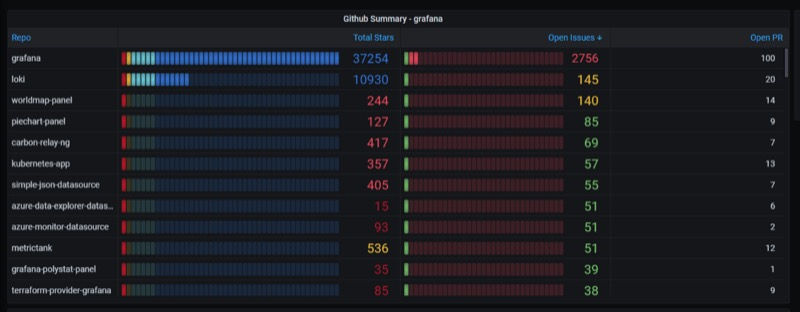
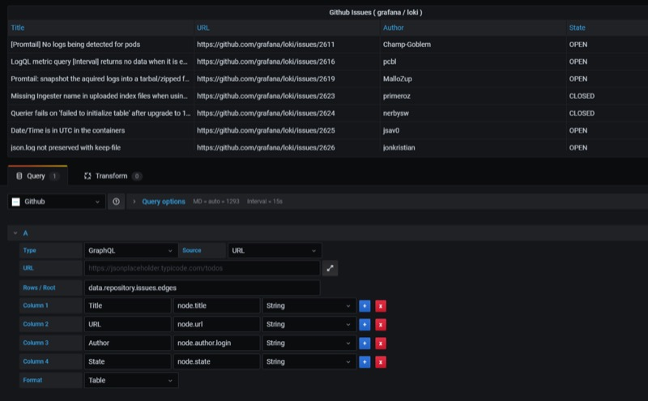
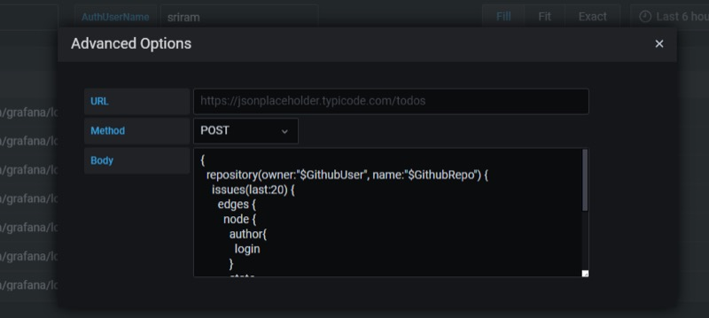
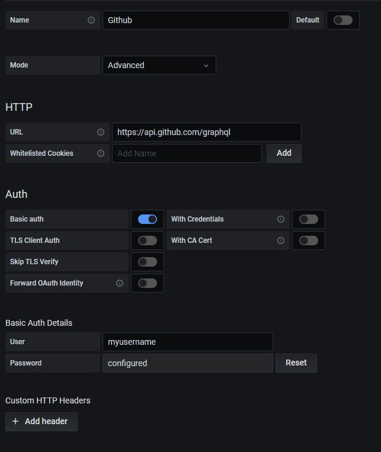

## Visualizing data from Github GraphQL API



We can use the [GitHub GraphQL API](https://docs.github.com/en/graphql) to query the GitHub stats with the Infinity plugin GraphQL API.

A sample query is provided in the example below, but you can customize your query to bring the stats you needed:

## Query Editor





Query Used:

```graphql
{
  repository(owner: "$GithubUser", name: "$GithubRepo") {
    issues(last: 20) {
      edges {
        node {
          author {
            login
          }
          state
          title
          url
        }
      }
    }
  }
}
```

## Datasource Configuration

Select **Basic user authentication** mode and use your GitHub username as the username and your Personal Access Token (PAT) as the password.



## Github Organization Summary example


The preceding image uses the following query:

```graphql
{
  repositoryOwner(login: "$GithubUser") {
    repositories(first: 100) {
      data: nodes {
        name
        stargazers {
          totalCount
        }
        openissues: issues(states: OPEN) {
          totalCount
        }
        openpr: pullRequests(states: OPEN) {
          totalCount
        }
      }
    }
  }
}
```

Note:

- Queries aren't paginated.
- Github rate limits apply.
- If you need a paginated and full set of results, use Grafana [GitHub stats plugin](https://grafana.com/grafana/plugins/grafana-github-datasource).
