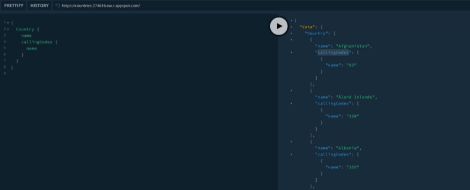
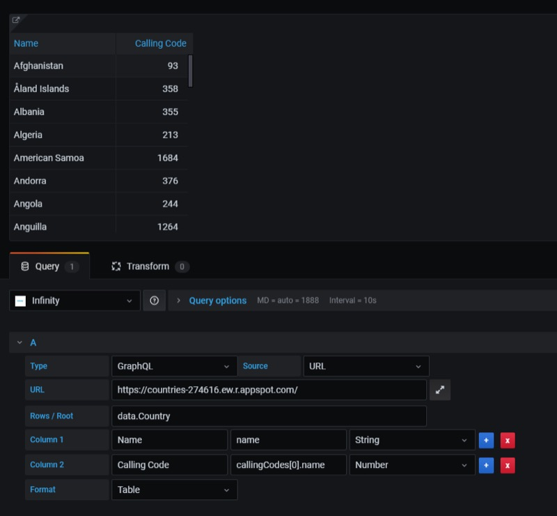
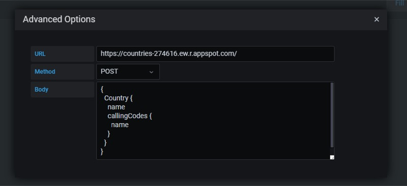

## Overview

With the Infinity datasource, you can also scrap data from any GraphQL endpoints. This works exactly in the same way as JSON API, but instead of using `GET` method used by the `JSON` API, this uses `POST` method with a body.

[Try it live: Infinity plugin GraphQL demo](https://play.grafana.org/d/infinity-graphql)

For example, consider the below GraphQL Endpoint. This returns list of countries and their calling codes.



With our plugin, we are going to list the above data as table with country name and calling code (1st calling code).



As shown in the image above, you need to specify the URL and fields you need. Next to the URL, you can see **advanced options** (expand icon) where you can enter your query as shown below:



```graphql
{
  countries {
    name
    continent {
      name
    }
  }
}
```

Make sure to select `POST` method when using the `graphql` API.
