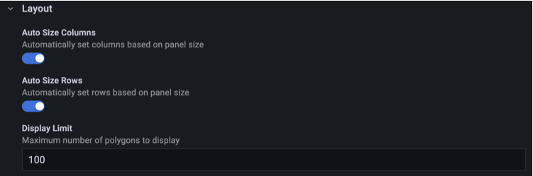

# Code editor

The code editor lets you write queries directly using the [Service Name] query syntax. Use this mode when you need full control over the query or when your query is too complex for the visual builder.



## Writing a query

Enter your query in the editor. The editor provides:

- **Syntax highlighting** for the query language
- **Autocomplete** for field names, functions, and keywords
- **Error highlighting** for syntax errors

### Example query

```
SELECT timestamp, value, source
FROM metrics
WHERE region = 'us-east-1'
  AND timestamp > now() - 1h
ORDER BY timestamp DESC
```

## Using Grafana variables

You can use Grafana [template variables](../template-variables/) in your queries. Variables are interpolated before the query is sent to the API.

```
SELECT timestamp, value
FROM metrics
WHERE region = '$region'
  AND source = '$source'
```

## Keyboard shortcuts

| Shortcut     | Action               |
| ------------ | -------------------- |
| `Ctrl+Enter` | Run query            |
| `Ctrl+Space` | Trigger autocomplete |
| `Ctrl+/`     | Toggle comment       |
