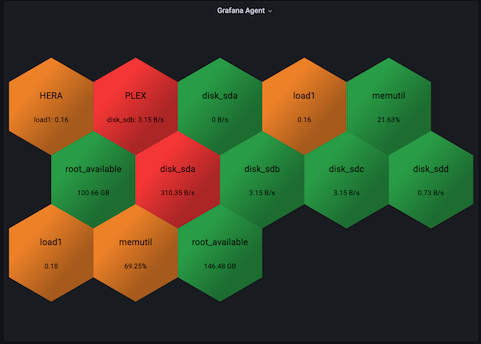

# Query builder

The query builder provides a visual interface for constructing queries without writing code.

## Building a query

### 1. Select a metric

Choose the metric you want to query from the **Metric** dropdown. The list is populated from your [Service Name] account based on available data.

### 2. Add filters

Click **+ Add filter** to narrow your results. Each filter consists of:

| Field | Description |
|-------|-------------|
| **Dimension** | The field to filter on (e.g., `region`, `source`) |
| **Operator** | The comparison operator (`=`, `!=`, `>`, `<`, `contains`) |
| **Value** | The value to compare against |

Multiple filters are combined with AND logic.

### 3. Configure aggregation

| Setting | Description |
|---------|-------------|
| **Function** | The aggregation function (`avg`, `sum`, `min`, `max`, `count`) |
| **Group by** | Dimensions to group results by |
| **Interval** | Time bucket size (e.g., `1m`, `5m`, `1h`). Leave empty to use the automatic interval based on the dashboard time range. |

### 4. Set the format

Choose the output format:

- **Time series** - For graph panels and time-based visualizations
- **Table** - For table panels and non-time-series data

## Limitations

Some advanced query patterns are not supported by the visual builder. If you need features like subqueries, joins, or complex expressions, switch to the [code editor](./code-editor/).
