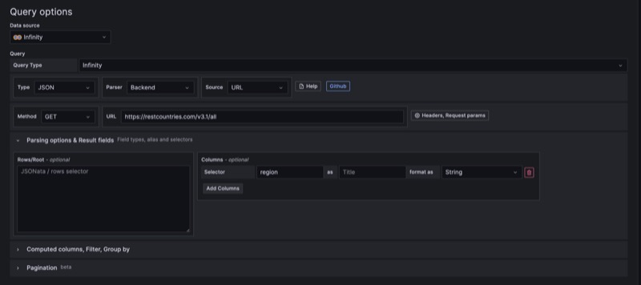
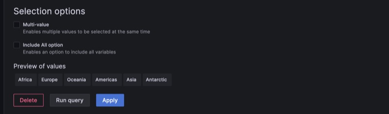
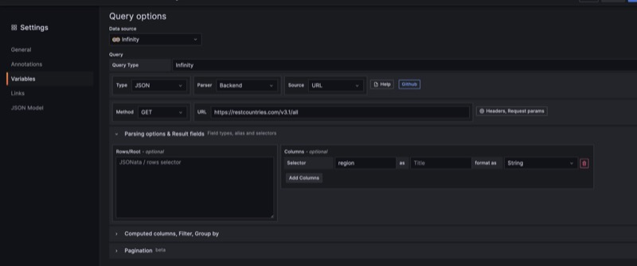
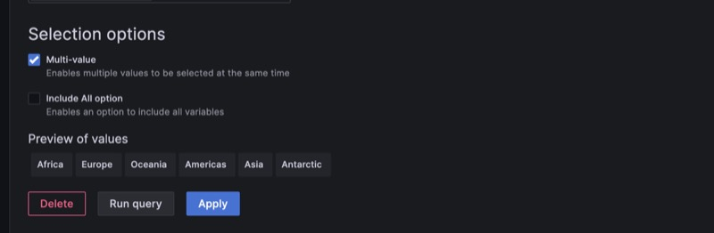
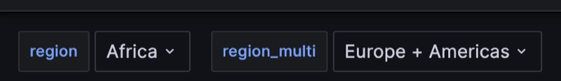
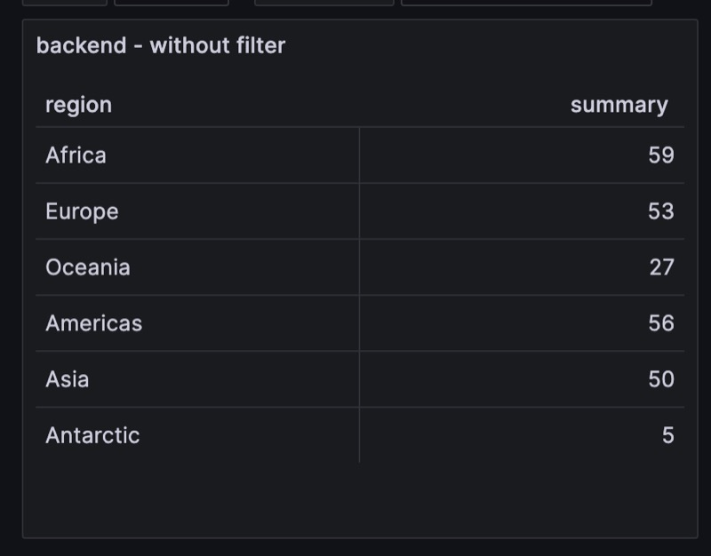
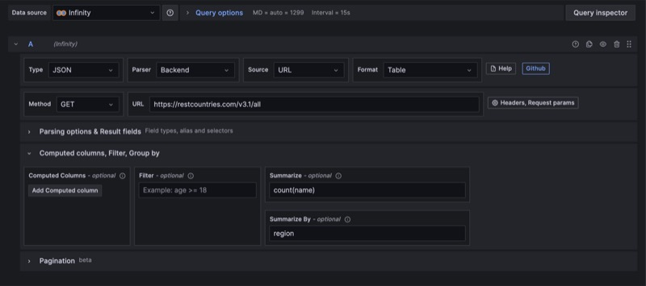
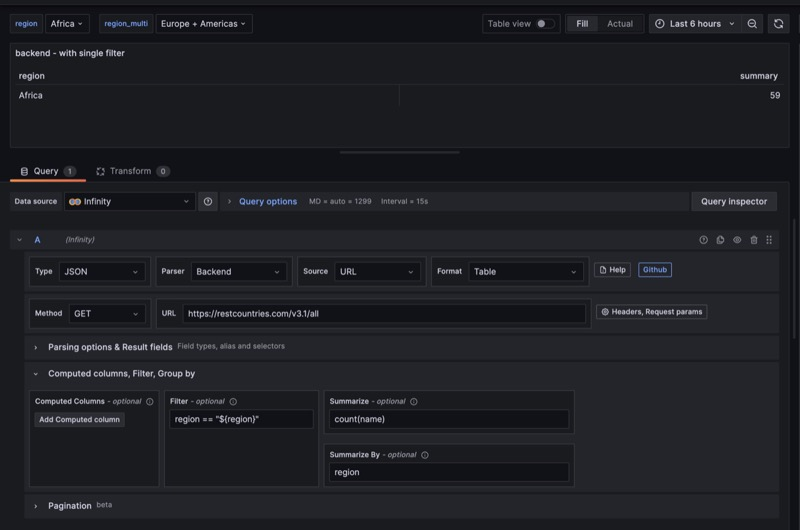
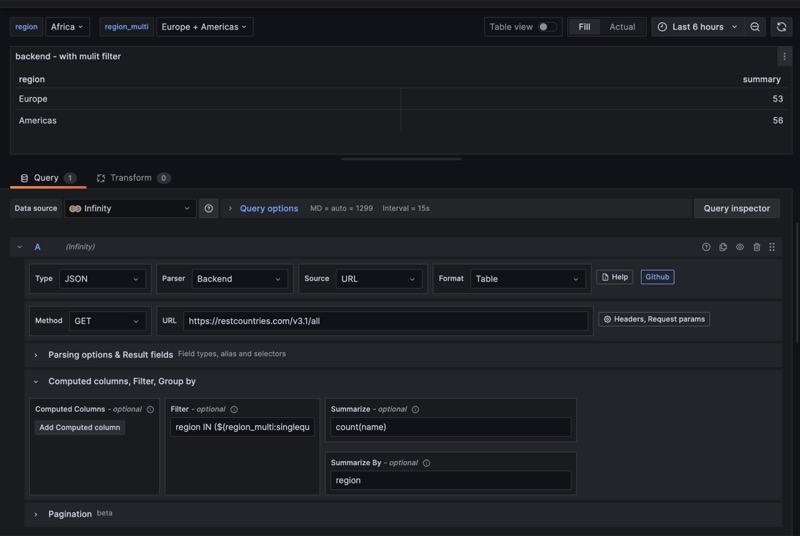
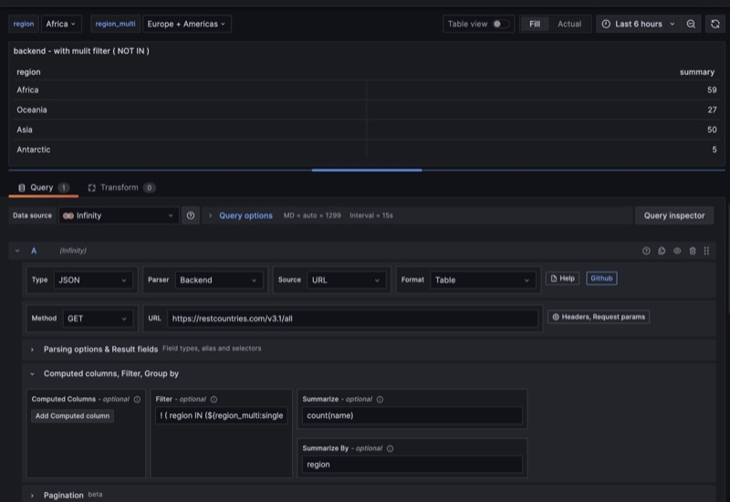

## Filtering data / Using template variables in Query

In order to filter the data in Infinity datasource, you can use the following options based on the parser you are using.

> **Note:** All filtering happens after retrieving the content. For better performance, use filtering provided by the API.

## Filtering with Backend Parser

When using the backend parser, use the following examples for filtering your data. In most cases, you will be filtering data based on single value or multiple value variable.

### Variable setup - single




### Variable setup - multi




### Without filter





### With single filter

We are using the filter `region == "${region}"`



### With multi filter

We are using the filter `region IN (${region_multi:singlequote})` to show multiple regions



### With multi filter (NOT IN)

We are using the filter `!(region IN (${region_multi:singlequote})` to exclude multiple regions. As you see we use `!` symbol before our condition



## Filtering with UQL Parser

When using the backend parser, use the following examples for filtering your data. In most cases you will be filtering data based on single value or multiple value variable.

### UQL - Without filter

```uql
parse-json
| summarize count("name") by "region"
```

### UQL - With single filter

```uql
parse-json
| where "region" == '$region'
| summarize count("name") by "region"
```

### UQL - With single filter (JSONata)

```uql
parse-json
| jsonata "$[region='${region}']"
| summarize count("name") by "region"
```

### UQL - With multi filter

```uql
parse-json
| where "region" in (${region_multi:singlequote})
| summarize count("name") by "region"
```

### UQL - Multi filter (JSONata)

```uql
parse-json
| jsonata "$[region in [${region_multi:singlequote}]]"
| summarize count("name") by "region"
```

### UQL - Multi filter (NOT IN)

```uql
parse-json
| where "region" !in (${region_multi:singlequote})
| summarize count("name") by "region"
```

### UQL - Multi filter (NOT IN) (JSONata)

```uql
parse-json
| jsonata "$[$not(region in [${region_multi:singlequote}])]"
| summarize count("name") by "region"
```
