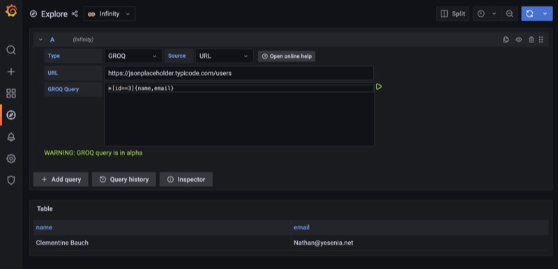

## GROQ Parser

[GROQ](https://groq.dev/) is query language which is designed to work directly on JSON documents. [GROQ](https://www.sanity.io/docs/groq) was developed by [Sanity.io](https://www.sanity.io/docs/groq) (where it's used as the primary query language).

> GROQ is still in ALPHA.

## Using GROQ with infinity

The following example shows how to make use of GROQ inside Grafana Infinity data source.

## Known limitations

- The library used under the hood is still is in [alpha](https://github.com/sanity-io/groq-js).
- With the initial test, only works with array type of docs.
