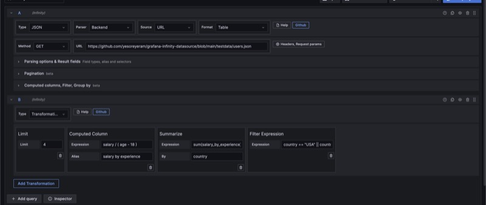
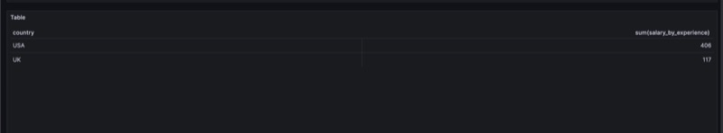

## Transformations

Server-side transformations are introduced in Infinity 2.0. You can perform basic data manipulation in the server side.

To perform server-side transformations, you need to add a query type of **transformations**. Once this added, **this will perform server side transformation over all the previous infinity queries with backend parser**.

> **Note:** Infinity Transformations/Server-side transformations are available only for Infinity data sources or Infinity queries with backend parsers.

## Example

## Supported transformations

### Limit

Limit transformation limits the number of result items rows in each query.

### Filter Expression

Filter the results based on column values in each query.

### Computed Column

Appends a new column based on expression.

### Summarize / Group by

Group by results based on aggregation and dimension.

> **Note:** All these transformations are done after processing. After the server responds with data, the Infinity backend client manipulates the data. If your API supports server-side transformations, use those instead.
