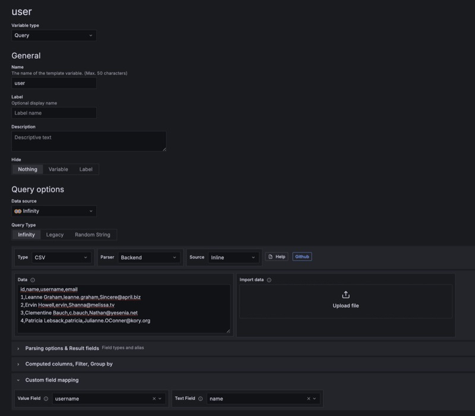
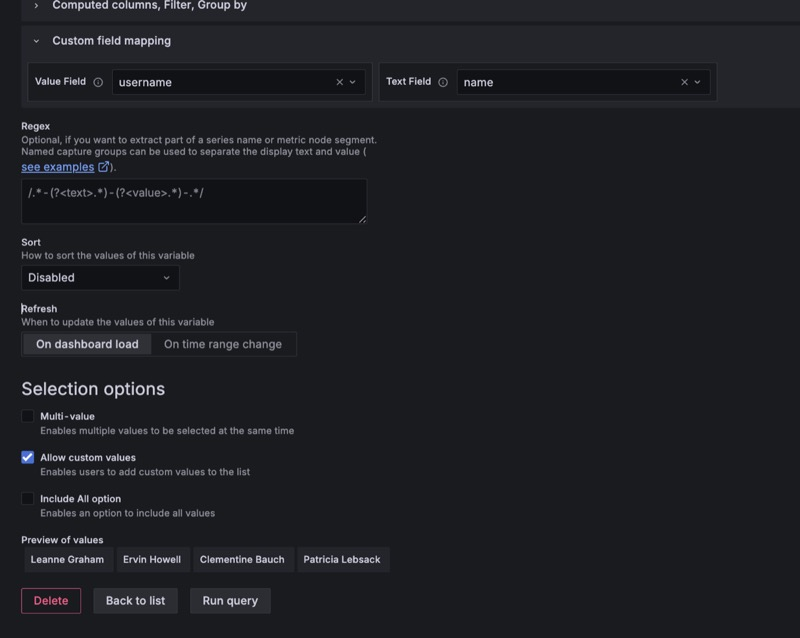
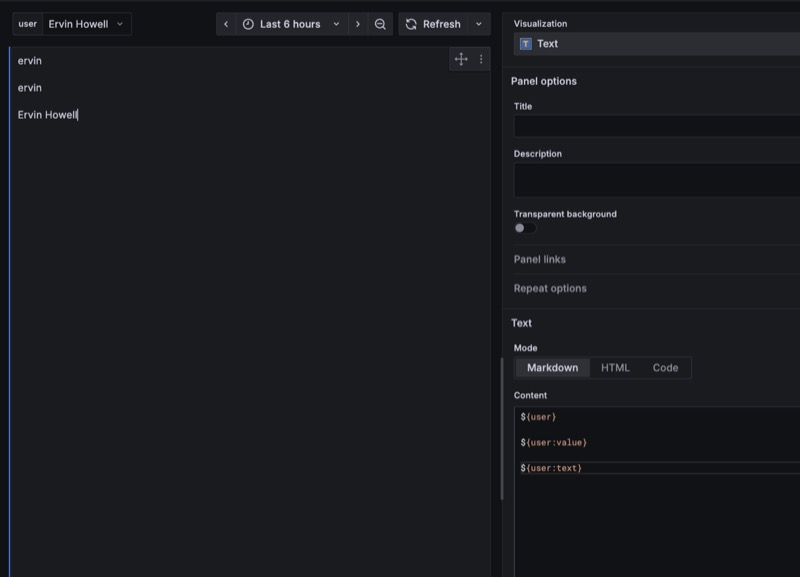

## Creating template variable using Infinity Query

Like panels, you can have your own CSV/JSON in your variable. Variable queries are expected to return one or more columns. This will give you the ability to get your variables set from CSV/JSON/XML or any other external sources.

> **Note**: If the variable query returns more than one field/column, You need to specify which field to be used as value field and which field to be used as text field in the **Custom field mapping** section of the variable editor
